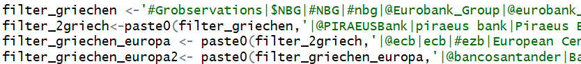
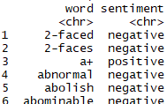
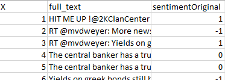
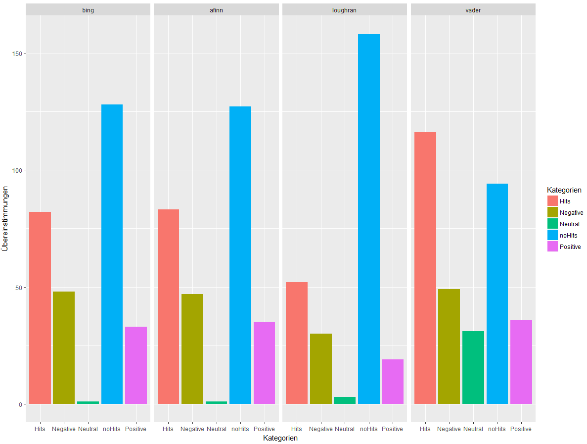

---
output:
  pdf_document: default
  html_document: default
---

---
classoption: oneside
documentclass: article
fontsize: 12pt
header-includes:
- \usepackage{amsthm}
- \usepackage{xcolor}
- \usepackage[ngerman]{babel}
- \usepackage[utf8]{inputenc}
- \usepackage{amsmath}
- \usepackage{amsfonts}
- \usepackage{amssymb}
- \usepackage[mathscr]{euscript}
- \usepackage{graphicx}
- \usepackage{subcaption}
- \usepackage{tabularx}
- \usepackage{url}
- \usepackage{hyperref}
- \usepackage[]{algorithm2e}
- \usepackage{mdframed}
- \usepackage{lipsum}
- \usepackage{extarrows}
- \usepackage[most]{tcolorbox}
- \usepackage{color}
- \usepackage{paralist}
- \usepackage{amsthm}
- \usepackage{blindtext}
- \usepackage{fancyhdr}
- \usepackage{colortbl}
- \usepackage{framed}
- \usepackage{float}
- \usepackage{listings}
- \usepackage{fancyhdr}
- \usepackage{geometry}
- \usepackage[onehalfspacing]{setspace}

geometry: top=2.5cm, bottom=2.5cm, left=2.5cm, right=2.5cm

output:
  pdf_document:
    number_sections: yes
  html_document: default
---


\newcommand{\mybox}[1]{%
  \tikz[baseline=(text.base)]
    {\node [draw,rounded corners,fill=red!20] (text) {#1};}%
}

\newtheoremstyle{normal}
{10pt} 
{10pt}
{\normalfont}
{}
{\bfseries}
{}
{0.8em}
{\bfseries{\thmname{#1} \thmnumber{#2}\thmnote{ \hspace{0.5em}(#3)\newline}}}
\theoremstyle{normal}

\newtheorem{satz}{Satz}
\newtheorem{defin}{Definition}
\newtheorem{beispiel}{Beispiel}

\pagenumbering{roman}

\renewcommand{\headrulewidth}{0.5pt}
\lhead{\nouppercase{\rightmark}}\rhead{}
<!-- \renewcommand{\sectionmark}[1]{\markright{\thesection.\ #1}} -->
<!-- \onehalfspacing -->
<!-- \cleardoublepage -->


\numberwithin{equation}{section}
\numberwithin{figure}{section}


<!--- Titelseite ---> \input{Titelblatt2} 
<!--- Inhaltsverzeichnis ---> \tableofcontents\newpage
<!--- Abbildungsverzeichnis ---> \listoffigures\newpage
\setlength{\parindent}{0pt} 
\renewcommand{\footrulewidth}{1pt}
\pagenumbering{arabic}
<!--- Beginn --->
\section{Ergebnisse} 

<!-- In einem Paper vom Herrn Becker stand, dass das Ergebnis direkt zu Begin präsentiert werden sollte -->


\section{Einführung}
Wenn Leser einen Text analysieren, verwenden sie, dass Verständnis der emotionalen Absicht von Wörtern, um daraus abzuleiten, ob ein Textabschnitt positiv oder negativ ist, oder ob er vielleicht durch eine andere nuanciertere Emotion wie Überraschung oder Ekel gekennzeichnet ist.
<!-- Sachen wir wir evtl. benötigen, oder soll das weggelassen werden? -->
\section{Aufgabenbeschreibung} 
Eine Sentiment Analyse soll ?ber die Banken von USA und Europa mittels den Twitterdaten auf dem Cuda erstellt werden. Die Twitterdaten liegen als R-Dataframe vor. Die Tabelle zeigt den Aufbau des DataFrames und die benötigten Daten. 

\begin{table}[H]
  \centering
  \begin{tabular}{lrrrr}
	Tweets & Follower			& favourites\_count			& friends\_count			& ... \\
    \hline
    My twit pic is sexy	& 81	& 101	& 3523	& 85 \\
    I am I really this tired	& 233	& 517	& 23542	& 99 \\
    F5 Copy	& 181	& 345	& 2672	& 99 \\
  \end{tabular}
  \caption{Ein Ausschnitt des DataFrames vom Cuda} \label{tab:example_dataframe_twits}
\end{table}


<!-- Wo kommen die Daten her? Welches Format hatten die Daten? Welches Format benutzen wird? -->
=======
\section{Daten}
Um ein Sentiment zu bilden, werden Daten mit Texten von Nutzern benötigt. Diese Daten wurden aus den zwei Quellen des Twitterarchives und durch die Twitter-API bezogen.
Weiterhin wurden Daten für den Vergleich mit den Sentiments benötigt, die im Unterkapitel Dividende (TODO) zu finden sind.
\subsection{Twitterarchive}
Twitter veröffentlicht monatlich 1 % ihrer gesamten Tweets auf \textit{archive.org}[TODO Referen?]. Auf dem CUDA-Rechner wurde das Twitterarchive aus dem Jahr 2012 in einem R-spezifischen DataFrame aufbereitet und zur Verfügung gestellt. Da diese Twitterdaten alle Tweets enthalten, auch Tweets die nicht benötigt werden, wurde ein Filter gebaut, der die benötigten Daten filtert.



In Abbildung \ref{fig:filter} ist einer unserer Filter für die grieschichen Banken zu sehen. Die Begriffe, nachdem gefiltert wird, sind in grün zu sehen. Diese sind jeweils durch einem logischen \textit{Oder} getrennt. Wird ein Begriff in einem Tweet gefunden, wurde dieser Tweet in unserem Datenbestand mitaufgenommen. 

Eine große Herausforderung war das Finden sinnvoller Begriffe zum Filtern. Sind die Begriffe nicht wohlwollend gewählt, könnten folgende Fälle eintreten, die sich wiederum negativ auf dem Sentiment auswirken könnten.

 * Ist ein Begriff zu allgemein gewählt, besteht die Möglichkeit Überschneidungen mit weiteren nicht bezogenen Themen auszuwählen. Z. B. ist der Begriff \textit{Bank} sehr allgemein gewählt, da die Bank im Park oder die Bank im Glücksspiel gemeint sein könnte. An dieser Stelle besteht die Möglichkeit die Anzahl der nicht gewollten Tweets abzuwägen. Sind diese anteilig gering, kann der Begriff als Filter aufgenommen werden.
 * Ist ein Begriff zu speziell gewählt, besteht die Möglichkeit zu wenige Tweets mit einzubeziehen.

Die Wahl der Begriffe ist demnach ein Trade-Off zwischen der Noise, die Anzahl der nicht relevanten Themen, und die Anzahl der gesamten Tweets, die nach dem Filtern übrig bleibt. Werden die Begriffe zu allgemein gewählt, werden zwar viele Tweets einbezogen, jedoch könnte dadurch die Noise sehr hoch werden. Werden die Filter zu streng gewählt, besteht die Möglichkeit zu wenige Tweets nach dem Filtern einzubeziehen.

Insgesamt haben wir ca. 17.000 Tweets durch die gewählten Filter über das gesamte Jahre 2012 gefiltert. Da das Sentiment wöchentlich gebildet wird, sind das ca. 325 Tweets pro Woche, die für das Bilden eines Sentiments ausreichen.

\subsection{Twitter-API}
\label{sub:scanned_data}
Zu Beginn war uns nicht klar, ob ausreichend Daten durch das Twitterarchive gewonnen werden können. Dadurch ergab sich die Idee, die Twitter-API zusätzlich zu verwenden. Die Twitter-API erlaubt 450 Anfragen alle 15 Minuten. Der Kern des PHP-Skriptes wird durch folgenden Code erleutert.

```php
// Query with one Hashtag and a limit up to 100
// GET call
$getfield = '?q=' . $hastag . '&
              result_type=recent&
              count=100&
              tweet_mode=extended';

// Setting up the Twitter-API
$twitter = new TwitterAPIExchange($this->settings);

// Perform the request
$data = $twitter->setGetfield($getfield)
                ->buildOauth($this->url, $this->requestMethod)
                ->performRequest();
```
Der obige Code zeigt die Abfrage eines Hastags. Die verschiedenen Hashtags werden mittels einer Schleife iteriert. Der Abruf (GET) wird mit einem URL Aufruf realisiert, der mit unterschiedlichen Einstellungen, wie Anzahl der maximalen Tweets (\textit{100}), welcher Typ (\textit{recent}) und in welchen Mode (\textit{extended}) werden die Tweets zurück gegeben, aufgerufen werden kann. Als nächstes werden die Settings übergeben. Die Twitter-spezifischen Settings werden nach der Registration im Entwicklungsbereich auf deren Webseite von generiert. Danach wird die Abfrage mittels der Twitter-Klasse realisiert. Die Rückgabe enthält ein Array im JSON-Format mit den letzten 100 Tweets. Zum Speichern werden die Tweets aufbereitet und als JSON-Format gespeichert.

Aktuell muss das Skript manuell ausgeführt werden. Dieses Problem haben wir durch ein \textit{Cronjob} gelöst. Ein Cronjob führt in definierten Intervallen oder an definierten Zeitpunkten ein Event, in unserem Fall eine PHP-Datei, aus. An dieser Stelle wurde entschieden die höher frequentierten Tweets auf einem zwei Minuten Intervall und weniger frequentierten Tweets auf einem 15 Minuten Intervall zu setzen.

\subsection{Dividende}
\label{sub:dividende}
TODO


\section{Wörterbücher}
Bevor ein Sentimentindex über einem Tweet erstellt werden kann, müssen die Stimmungen aus dem jeweiligen Tweet extrahiert werden. Diese Extraktion passiert im einfachsten Fall mit einem oder mehreren Wörterbüchern.

Ein Wörterbuch besteht aus einer Liste von Wörtern, die von einem oder mehreren bewertet wurden. Die Bewertung kann 1/0, Negativ/Positive, 0-10 usw. sein. Die Abbildung \ref{fig:worterbuch} zeigt ein Wörterbuch aus dem R-Package \textit{tidytext}. Die Spalte \textit{word} steht für das bewertende Wort und \textit{sentiment} für deren Bewertung.



Ein \textbf{Hononym} ist der Begriff für die Doppeldeutigkeit eines Wortes, zum Beispiel \textit{Bank}. Wird ein Wort für ein Wörterbuch bewertet, muss der Kontext in dem sich das Wörterbuch befindet, beachtet werden. Angenommen es existieren zwei Wörterbücher, wobei jeweils eins für die Natur und  eins für den Immobiliensektor abgestimmt ist. Das Wort \textit{Bank} kann in diesem Fall zwei unterschiedliche Bewertung erhalten. In der Natur könnte eine Bank eher als positiv bewertet werden, wohingegen die Bank für den Immobiliensektor eher negativ ausgelegt werden könnte.

Um die \textbf{Güte eines Wörterbuches} beurteilen zu können, werden Tweets benötigt, die in irgendeiner Art und Weise eine Bewertung beinhalten. Der gegebene Datensatz aus Kapitel \ref{sub:scanned_data} von Tweets erhielt kein Merkmal, welches auf eine Stimmung hinweisen könnte. Die Konsequenz war Teile des Datensatzes manuell und subjektiv zu bewerten. In der Abbilung \ref{fig:testdata_bewertet} sind die Bewertungungen mit \textit{sentimentOriginal}, den Tweettext mit \textit{full\_text} und die Nummerierung mit \textit{X} zu sehen.



\subsection{Verwendete Wörterbücher}

In diesem Bericht wurden die Wörterbücher \textit{bing}, \textit{afinn} und \textit{loughran} aus dem R-Package \textit{tidytext} und das vaderSentiment verwendet (TODO verlinken, bzw. in der Referenz erwähnen).

\begin{table}[H]
\centering
\begin{tabular}{l|rrr}
\textbf{Wörterbuch}     & \multicolumn{1}{l}{\textbf{Bewertungsart}} & \multicolumn{1}{l}{\textbf{Intelligenz}} & \multicolumn{1}{l}{\textbf{Programmiersprache}} \\
\hline
\textbf{bing}           & Positiv/Negativ                            & -                                        & R                                               \\
\textbf{afinn}          & -5 bis 5                                   & -                                        & R                                               \\
\textbf{loughran}       & Positiv/Negativ                            & -                                        & R                                               \\
\textbf{vaderSentiment} & -4 bis 4                                   & vaderSentiment                           & Python                                         
\end{tabular}
\caption{Übersicht der verwendeten Wörterbücher}
\label{tab:used_wordbooks}
\end{table}

In Tabelle \ref{tab:used_wordbooks} sind die verwendeten Wörterbücher mit deren Bewertungsart, ob eine Intelligenz verfügbar und in welcher Programmiersprache dieses Wörterbuch ursprünglich vorhanden war, aufgelistet. Die Wörterbücher "bing" und "loughran" arbeiten mit positiven und negativen Bewertungen, "afinn" arbeitet mit einer Bewertungsreichweite von -5 bis 5, wobei -5 die negativste- und 5 die positivste Stimmung wiederspiegelt. Das Wörterbuch "vaderSentiment" wurde von 10 unabhängigen Menschen manuell mit der Reichweite -4 bis 4 bewertet und davon der Durchschnitt und die Standardabweichung berechnet. Weiterhin wurde eine Logik von den Machern hinterlegt, die Verneinung, Satzzeiten, groß geschriebene Wörter u. v. m. bei der Berechnung des Sentiments beachtet.


Zu Beginn wurden mittels den vier Wörterbüchern ein Sentiment über den Testdatensatz berechnet. Diese Berechnung wurde mittels der Abbildung \ref{fig:ubereinstimmung_nothing} visualisiert. Jeder Block entspricht ein Wörterbuch und jeder Balken spiegelt die Anzahl der Treffer wieder. 

 * Die \textit{Hits} sind die Anzahl der gesamten Treffer.
 * Die \textit{noHits} spiegelt die Anzahl der keinen Treffer wieder.
 * Die \textit{negativen} Treffer sind ausschließlich die Anzahl der negativen Treffer
 * Die \textit{positiven} Treffer sind ausschließlich die Anzahl der positiven Treffer
 * Die \textit{neutralen} Treffer sind ausschließlich die Anzahl der neutralen Treffer



Die Wörterbücher "bing" und "afinn" liegen können insgesamt um die 70 Übereinstimmungen aufweisen, wohingegen "loughren" knapp über 50 vorweisen kann. Das beste Wörterbuch ist "vader" mit ca. 120 Übereinstimmmungen. Eine weitere Auffälligkeit bezüglich "bing", "afinn" und "vader" sind die Anzahl der Übereinstimmungen im Bereich der positiv bewertenden Tweets. Jedoch punktet "vader" bei den neutralen Tweets, wo er mit ca. 30 Übereinstimmungen die beste Performance liefert.

\subsection{Stemming}

Die Idee hinter Stemming ist das Reduzieren einer Wortvariante auf seinem Wortstamm. Zum Beispiel werden die Worte "Häuser" und "Häusern" zu deren Wortstamm "Haus" reduziert.

Um das Stemming durchzuführen, wurde das R-Package \textit{corpus} verwendet. Die folgenden Varianten des Stemmings wurden durchgeführt.

 * Corpus unterstützt vom Haus aus 17 unterschiedliche Sprachen, um ein Wortstamm zu bilden. Da der gegebene Datensazu nur englische Texte enthält, wurde nur die englische Sprache betrachtet des Standard-Packetes betrachtet.
 * Der \textit{Hunspell stemmer} soll prezisere Stämme bilden.
 * Der \textit{Dictionary stemmer} wird on-the-fly von lexoconista.com als Tupels von (Wörter, Stamm) geladen und danach mittels einer Funtkion den corpus-Package übergeben.
 * Hunspell liefert eine \textit{Rechtschreibkorrektur} mit. Zu Beginn wird geprüft, ob das Wort im Hunspell-Stemming-Wörterbuch existiert. Falls das Wort existiert, wird der Wortstamm zurück gegeben. Falls das Wort im Hunspell-Stemming-Wörterbuch nicht existiert, wird versucht ähnliche Wörter mittels der bereits existierten Funktion zu finden.
 
Für die gestemmten Tweets wurden die gleichen Auswertungen berechnet, wie in Abbildung \ref{fig:ubereinstimmung_nothing} zu sehen ist. Dabei verschlechterten alle Stemming-Verfahren den Score. Die einzige Ausnahme gilt der Rechtschreibkorrektur, die insgesamt zwei Tweets mehr erkennt.


\subsection{Ausblick}
In diesem Kapitel wurden 4 verschiedene Wörterbücher und 4 verschiedene Stemming-Verfahren, wobei ein Verfahren die Rechtschreibkorrektur ist, verwendet. Neben weiteren Wörterbüchern, Stemming-Verfahren und besseren Rechtschreibkorrekturen besteht die Möglichkeit anstatt 1-gram mit 2-gramme oder 3-gramme zu arbeiten. Das bedeutet dementsprechend angepasst Wörterbücher zu verwenden. Laut dem [Paper 5 TODO] ist dieser Ansatz sehr vielversprechend.

Ein weiterer interessanter Ansatz ist das Verwenden mehrere Wörterbücher und deren Ergebnisse durch ein Votum entscheiden zu lassen. Angenommen drei Wörterbücher beurteilen ein Tweet. Zwei Wörterbücher beurteilen den Tweet als negativ und das dritte Wörterbuch als positiv. Im nächsten Schritt wird durch das Votum der Tweet als negativ klassifiziert, da mehr Wörterbücher den Tweet als negativ eingestuft hatten. Eine Verfeinerung des Votums ist durch eine mögliche Gewichtung der Wörterbücher möglich.


\section{Datenaufbereitung}
Um lokal auf den eigenen Rechnern zur Arbeite, war der erste Schritt die Daten auf den Cuda Rechner auf zu splitten in kleinere Pakete. 

Hier Code Einfügen 


Für die Berechnung der Sentimentindizes werden nur Tweets betrachtet die mit \textit{eng} gekennzeichnet sind. Es werden Indizes für Europa und die USA gebaut, über die Tweets der Banken. Um die Tweets der Banken für Europa und der USA herauszufiltern, wird ein Filter benötigt. Hierzu wird ein langer String mit den Namen von Banken zusammengebaut.\\
<!--\textbf{String Filter der US-Banken-Tweets:}\\
"JPMorgan Chase|\@jpmorgan|jpmorgan|jpmorgan chase|#jpmorgan|Citigroup Global Markets Inc.|citigroup global markets|citibank|citigroup|\@Citi|\@Bank of America|Bank of America|bank of america|#bankofamerica|\@WellsFargo|Wells Fargo|wells fargo|Goldman Sachs & Co. LLC|GoldmanSachs|Morgan Stanley|\@MorganStanley|\@usbank|us bank|\@Aetna|\@Affiliated_Bank|\@Affiliated_Bank|\@PNCBank|\@PNCNews|\@PNCBank_Help| \@BNYMellon|BNY Mellon|\@MetLife|\@Voya|\@lincolnfingroup|\@principal|\@GNWFinancial|#genworth|\@Ally|\@TheHartford|Hartford financial|\@CapitalOne|\@AskCapitalOne|\@COFInvesting|\@hartfordfunds|Hartford Funds|hartford funds|\$MBI|\@AssociatedBank|Associated Bank|associated bank|\@AssociatedBiz|#associatedbank|\@CNOFinancial|CNO Financial Group|\@CitizensBank|Citizens BankVerified|#citizensbank"

\textbf{String Filter Banken-Tweets:}\\
'#Grobservations|\$NBG|#NBG|#nbg|\@Eurobank_Group|\@eurobank_group|Eurobank_group|\@Alpha_Bank|aplha bank|Alpha Bank|#alphabank|\@PIRAEUSBank|piraeus bank|Piraeus Bank|piraeus bank|#piraeusbank|\@ecb|ecb|#ezb|European Central Bank|european central bank|\@HSBC_UK|HSBC UK|hsbc uk|hsbc bank|\@bancosantander|Banco Santander|banco santander|#bancosantander|\@BNPParibas|BNP Paribas Group|bnp paribas group|#bnpparibas|\@ING_news|ING Group|ing group|\@ingnl|\@UBSchweiz|UBS Schweiz|ubs schweiz|\@UBS|\@AskLloydsBank|Lloyds Banking Group|\@LBGNews|\@AskHalifaxBank|\@AskBankOfScot|lloyds banking group|#barclay|#hsbc|\@UKFtweets|UK Finance|\@triodosuk|Triodos Bank UK|\@BankofIrelandUK|Bank of Ireland UK|bank of ireland uk|Royal BankVerified account|\@RBS_Help|\@StanChart|Standard Chartered|\@nexgrp|\@OldMutual|Old Mutual plc|\@ParagonBankNC|Paragon Bank|BritishBusinessBankVerified account|\@BritishBBank|\@PIRAEUSBank|piraeus bank|Piraeus Bank|piraeus bank|#piraeusbank|\@SocieteGenerale|Societe Generale|\@CreditAgricole|Credit Agricole|#bnp|\@natixis|Natixis|#natixis|\@AXA|#AXA|AXA|\@bancosantander|bancosatnander|#BancoSantander|Banco Santander|$SAN|\@bbva|\@CajadeAhorrosPA|Caja de AhorrosP|caja de ahorrosP|\@Bankia|Bankia|bankia|\@Bankinter|Bankinter|FDN Colombia|\@FDNcolombia|\@UniCredit_PR|UniCredit Group|\@intesasanpaolo|intesa sanpaolo|\@IntesaSP_Help|#intesasanpaolo|\@BancoBPMSpa|BancoBPM|\@UnipolGroup_PR|Unipol Group PRVerified account|\@UniCredit_PR|\@Rabobank|#Rabobank|rabobank|\@rabobank'-->
```{r, echo=FALSE}
filter <-'JPMorgan Chase|@jpmorgan|jpmorgan|jpmorgan chase|#jpmorgan|Citigroup Global Markets Inc.|citigroup global markets|citibank|citigroup|@Citi|@Bank of America|Bank of America|bank of america|#bankofamerica|@WellsFargo|Wells Fargo|wells fargo|Goldman Sachs & Co. LLC|GoldmanSachs'
filterusa<-paste0(filter,'|Morgan Stanley|@MorganStanley|@usbank|us bank|@Aetna|@Affiliated_Bank|@Affiliated_Bank')
filterusan<-paste0(filterusa,'|@PNCBank|@PNCNews|@PNCBank_Help|@BNYMellon|BNY Mellon|@MetLife|@Voya|@lincolnfingroup|@principal|@GNWFinancial|#genworth|@Ally|@TheHartford|Hartford financial|@CapitalOne|@AskCapitalOne|@COFInvesting|@hartfordfunds|Hartford Funds|hartford funds|$MBI|@AssociatedBank|Associated Bank|associated bank|@AssociatedBiz|#associatedbank|@CNOFinancial|CNO Financial Group|@CitizensBank|Citizens BankVerified|#citizensbank')

filter_griechen <-'#Grobservations|$NBG|#NBG|#nbg|@Eurobank_Group|@eurobank_group|Eurobank_group|@Alpha_Bank|aplha bank|Alpha Bank|#alphabank'
filter_2griech<-paste0(filter_griechen,'|@PIRAEUSBank|piraeus bank|Piraeus Bank|piraeus bank|#piraeusbank')
filter_griechen_europa <- paste0(filter_2griech,'|@ecb|ecb|#ezb|European Central Bank|european central bank|@HSBC_UK|HSBC UK|hsbc uk|hsbc bank')
filter_griechen_europa2<- paste0(filter_griechen_europa,'|@bancosantander|Banco Santander|banco santander|#bancosantander|@BNPParibas|BNP Paribas Group|bnp paribas group|#bnpparibas|@ING_news|ING Group|ing group|@ingnl|')
filter_ch<-'@UBSchweiz|UBS Schweiz|ubs schweiz|@UBS|'
filter_gb<-'@AskLloydsBank|Lloyds Banking Group|@LBGNews|@AskHalifaxBank|@AskBankOfScot|lloyds banking group|#barclay|#hsbc|@UKFtweets|UK Finance|@triodosuk|Triodos Bank UK|@BankofIrelandUK|Bank of Ireland UK|bank of ireland uk|Royal BankVerified account|@RBS_Help|@StanChart|Standard Chartered|@nexgrp|@OldMutual|Old Mutual plc|@ParagonBankNC|Paragon Bank|BritishBusinessBankVerified account|@BritishBBank|'
filter_db <-'@DeutscheBankAG|@DeuBaService|@DeutscheBank|$DB|#deutschebank|@TalkGTB|@DeutscheBankBE|@commerzbank|commerzbank|#commerzbank|@KfW|#kfw|kfw bank|@wuestenrot_de|@spardanuernberg|Sparda-Bank N?rnberg|sparda-bank|oldenburgische landesbank|@comdirect|comdirect bank AG|comdirect bank|#Allianz|alistra office|#DAXIndex|Deutsche B?rse GroupVerifizierter Account|@DES_AG|Deutsche EuroShop AG|#bayernlb|@BremerLB|@LBBW|#landesbank|Landesbank Hessen-Th?ringen|#helaba|@Helaba|@nord_lb|@ING_DiBa_Presse|@INGDiBaAustria|'
filter_fr <-'@PIRAEUSBank|piraeus bank|Piraeus Bank|piraeus bank|#piraeusbank|@SocieteGenerale|Societe Generale|@CreditAgricole|Credit Agricole|#bnp|@natixis|Natixis|#natixis|@AXA|#AXA|AXA|'
filter_sp <-'@bancosantander|bancosatnander|#BancoSantander|Banco Santander|$SAN|@bbva|@CajadeAhorrosPA|Caja de AhorrosP|#CaixaCatalu?a|caja de ahorrosP|@Bankia|Bankia|bankia|@Bankinter|Bankinter|FDN Colombia|@FDNcolombia|'
filter_i <- '@UniCredit_PR|UniCredit Group|@intesasanpaolo|intesa sanpaolo|@IntesaSP_Help|#intesasanpaolo|@BancoBPMSpa|BancoBPM|@UnipolGroup_PR|Unipol Group PRVerified account|@UniCredit_PR|'
filter_nl <-'@Rabobank|#Rabobank|rabobank|@rabobank'
filter_europa<- paste0(filter_griechen_europa2,filter_ch)
filter_europa <-paste0(filter_europa,filter_gb)
filter_europa <-paste0(filter_europa,filter_db)
filter_europa <-paste0(filter_europa,filter_fr)
filter_europa <-paste0(filter_europa,filter_sp)
filter_europa <-paste0(filter_europa,filter_i)
filter_europa <-paste0(filter_europa,filter_nl)
```
Im Folgendem werden nun die einzelnen Schritte für die Aufbereitung der Daten beschrieben, die notwendig sind, um verschiedene Sentimentindizes zu berechnen, auf Basis von Wörterbüchern. Hierzu werden eigens programmierten Funktionen benutzt.
\begin{itemize}
\item \textbf{Step 1:} Die erzeugten CSV-Datei mit den gefilterten Tweets werden mit der Funktion \textit{Datei$\_$einlesen} eingelesen und in ein Dataframe umgewandelt.
\item \textbf{Step 2:}Um mit den Daten besser arbeiten zu können, müssen die Tweets mit einer Spalte \textit{Month2} und \textit{week} ergänzt werden. Mit den Spalten \textit{Month2} und \textit{week} können Indizies für Monaten und Wochen berechnet werden, dafür wird die Funktion Kalenderwochen verwendet.
\item \textbf{Step 3:} Im Anschluss werden die Tweets die mehrfach im Dataframe vorkommen herausgefiltert, mit der Funktion \textit{Distinct}.
\item \textbf{Step 4:} Mit der Funktion \textit{clearing$\_$dataframe} werden die Texte der Tweets aufgesplittet in ihren Wörtern, somit besteht ein Datensatz aus einem Wort des Tweets und den vorherigen Spalten. Anschließend wird der Dataframe bereinigt von Stopwörtern, die in der Wörterliste \textit{Stopwords} enthalten sind. Das Wörterbuch steht in R schon zur Verfügung. Für weitere Informationen hierfür wird auf die Dokumentation in R verwiesen. Die untere Tabelle zeigt einen Ausschnitt des Dataframe, dass verwendet wird, um die Sentimentindexe zu berechnen. 

\begin{table}[H]
\centering
\caption{Aufbereiter Dataframe}
\label{dataaufbereitung}
\begin{tabular}{|l|l|l|l|l|l|l|l|}
\hline
\textbf{id} & \textbf{X} & \textbf{Language} & \textbf{Follower} & \textbf{favourites\_coun} & \dots & Month2 & week \\ \hline
2           & 12         & en                & 1114              & 0                         &              & 1      & 1    \\ \hline
3           & 12         & en                & 114               & 0                         &              & 1      & 1    \\ \hline
 \vdots           &   \vdots           &  \vdots                  &  \vdots                 &  \vdots                         &  \dots            &  \vdots      &  \vdots    \\ \hline
12          & 13         & en                & 319               & 0                         &              & 1      & 1    \\ \hline
13          & 13         & en                & 319               & 0                         &              & 1      & 1    \\ \hline
\end{tabular}
\end{table}
\end{itemize}
\subsection{Aufbereitung der Dow Jones Industrial 30 Aktienindex aus 2012}
Der \textit{Dow-Jones-Industrial} 30 Index misst die Entwicklung des US-amerikanischen Aktienmarktes. Der Dow-Jones-Index an der New York Stock Exchange (NYSE) ist einer der älteste noch bestehende Aktienindex der USA und setzt sich heute aus $30$ der größten US-Unternehmen zusammen. Der tägliche Aktienindex des \textit{Dow-Jones-Industrial} 30 $2012$ der für die späteren Regressionen verwendet wird, stammt von der Seite \url{http://www.boerse-online.de/index/historisch/dow_jones/1.1.2012_31.12.2012}.
Die Daten werden in eine Excel-Datei überführt. Anschließen wird die wöchentlichen Veränderungen des Aktenindex in prozent berechnet. In der unteren Grafik ist ein kleiner Auschnitt abgebildet von den aufbereiteten Daten.
 \begin{figure}[H]
   	\centering
  \includegraphics[width=1\textwidth]{Pictures/Dow_jownes.png}
   	\caption{Ausschnitt des Aufbereiteten \textit{Dow Jones Industrial} $30$ Aktienindexes}
   	\label{Dow_jones}
 \end{figure}

\section{Wörterbücher}
Wenn Personen einen Text lesen, verwenden sie das Verständnis Wörtern zu deuten, um daraus abzuleiten, ob ein Textabschnitt positiv oder negativ ist, oder vielleicht durch andere nuanciertere Emotionnen wie Überraschung oder Ekel gekennzeichnet ist. Die Werkzeuge des Text Mining werden nun genutzt, um den emotionalen Inhalt von Texten zu analysieren. Hierzu benötigen wir Wörterbücher die Wörter kennzeichne als positive/negative oder mit einem Score. In dieser Ausarbeitung nutzen wir zur Berechnung von Sentimentindize die allgemeinen Wörterbücher afinn, bing, nrc und warp.Alle drei dieser Wörterbücher basieren auf Unigrammen, d.h. auf einzelnen Wörtern. Diese Wörterliste enthalten viele englische Wörter und den Wörtern werden Noten für positive/negative Gefühle und möglicherweise auch Emotion wie Freude, Wut, Traurigkeit zugeordnet. 

AFINN ist eine Liste von englischen Wörtern, die für Valenz mit einer ganzen Zahl zwischen minus fünf (negativ) und plus fünf (positiv) bewertet wurden. Die Wörter wurden von Finn ?rup Nielsen in den Jahren $2009-2011$ manuell beschriftet. Die Datei ist tabulatorgetrennt. Die Wortliste wurde erstellt für die Stimmungsanalyse für Microblogs.
```{r echo=FALSE}
library(tidytext)
get_sentiments("afinn")
```
Das bing-Wörterbuch von \textit{Bing Liu} and collaborators kategorisiert Wörterbücher in positive und negative Kategorien.
```{r echo=FALSE}
library(tidytext)
get_sentiments("bing")
```
Das NRC Emotion Wörterbuch ist eine Liste englischer Wörter und ihrer Assoziationen mit acht grundlegenden Emotionen (ärger, Angst, Erwartung, Vertrauen, überraschung, Traurigkeit, Freude und Ekel) und zwei Gefühlen (negativ und positiv). Die Annotationen wurden manuell per Crowdsourcing vorgenommen. 
```{r echo=FALSE}
library(tidytext)
get_sentiments("nrc")
```

\section{Berechnung der Sentimentindizes}
<<<<<<< HEAD
  Für die Berechnung von Sentimentindizes wird vorgegangen nach dem Buch \textit{Text Mining with R} von \textit{Julia Silge and David Robinson}. Im Buch \textit{Text Mining with R} werden die Sentimentindizes mittels dem Prinzip \textit{tidy data} in R erstellt. Ein kleines Beispiel für einen einfachen Sentimentindex, der positive und negative Wörter für jede Woche zählt soll kurz vorgestellt werden. Zur Berechnung des Sentimenindex wird der vorbereitete Dataframe aus dem Kaptiel \textit{Datenaufbereitung} benutzt. Zuerst wird der vorbereitete Dataframe ( \textit{clearing$\_$data}) mit dem Wörterbuch \textit{Bing} gejoint mit der gleichnamige Spalte \textit{word}.Im Anschluss wird der Dataframe gruppiert nach Wochen und dabei werden die verschiedene  Ausprägungen (\textit{positiv} und \textit{negativ}) in der Spalte \textit{Sentiment} gezählt. Für die gezählten Ausprägungen pro Woche entsteht eine neue Spalte \textit{n}. In der Spalte \textit{Sentiment} stehen die Wörter (Ausprägungen) \textit{positiv} oder \textit{negativ} passend zu dem Wort in der Spalte \textit{word} im Datensatz. Um einen Index pro Woch zu berechnen, wird eine Spalte für jede Ausprägung mit ihrer Anzahl pro Woche erzeugt, aus den Spalten \textit{Sentiment} und \text{n}. Zum Schluss wird eine neue Spalte \textit{Sentiment} gebildet indem die Anzahl, der positiven minus den negativen Wörter stehen ($Sentiment=positiv-negativ$). Der Sentimentindex \textit{Sentiment} wird als Barplot dargestell, mittels einem ggplots.
```{r  eval=FALSE, echo=FALSE}
source("../Testing/SentimentFunctionChris.R")
#source("varianz.R")
source("../Testing/functions.R")
pakete_lade()
#Aufbereitung der Daten----------------------------------
 file<-"../Testing/Daten2012usa.csv"
 daten_usa<-Datei_einlesen(file)

kalenderwochen_hinzufuegen<-Kalenderwochen(daten_usa)
daten_doppelt_loeschen<-Distinct(kalenderwochen_hinzufuegen)
clearing_data<- clearing_dataframe(daten_doppelt_loeschen)
>>>>>>> d88b9fd4770017cd924e3d18b871974a5a6124b3
```

```{r eval=FALSE, echo=TRUE}

  bing <- get_sentiments("bing")
    differenz_positive_negative<-  clearing_data  %>%
      inner_join(bing) %>%
      group_by(week)%>%
      count(sentiment) %>%
      spread(sentiment, n)%>%
      mutate(sentiment = positive - negative)
    
differenz_positive_negative    
ggplot(data= differenz_positive_negative, 
       es(x=week, y=sentiment),fill=sentiment) +geom_col(show.legend = FALSE)
      +geom_bar(stat="identity",  fill="blue",colour="black")
      +xlab("Wochen")+ylab("Sentimentindex")
```
 \begin{figure}[H]
   	\centering
  \includegraphics[width=1\textwidth]{Pictures/sentiment_bing_week.png}
   	\caption{Sentimentindex: monatlicher Mittelwert}
 \end{figure}

In der unteren Liste werden einige Sentimentindizes mit ihren Funktionen aufgeführt, die von uns implementiert wurden in R. Die Funktionen der aufgezählten Sentimentindizes werden in der R-Datei \textit{SentimentFunctionChris.R} bereitgestellt. Bei allen Funktionen müssen zwei Parameter übergeben werden, den vorbereitete Dataframe und einen String (\textit{Woche} und \textit{Monat}) der angbit, ob ein Sentiment pro Woche oder pro Monat berechnet wird. 
\begin{itemize}
\item \textit{Wörterbuch Bing:} Einzelene Tweets werden als negative, positive oder als neutral gekennzeichnet. Die Tweets die mehr positive als negative Wörter besitzen, werden als positve makiert anders herum als negative, bei gleichstand als neutral.
 \begin{figure}[H]
\centering
 	\includegraphics[width=1\textwidth]{Pictures/tweetebene.png}
 	\caption{Sentimentindex auf Tweetebene}
\end{figure}

\item \textit{Wörterbuch AFINN:} Die Funktion \textit{afinn$\_$score$\_$wert} bildet den Mittelwert pro Woche und Monat.
 \begin{figure}[H]
\centering
 	\includegraphics[width=1\textwidth]{Pictures/afinn_mittelwert.png}
 	\caption{Sentimentindex auf Tweetebene}
\end{figure}
\end{itemize}


\section{Analysen von Tweets und ihrer Sentimentindizies}
In diesem Abschnitt soll kurz angerissen werden, welche Methoden und Mitteln man verwenden kann, um Tweets und Sentimentindizes zu analysieren. Um einen ersten Eindruck von den Tweets zu bekommen, ist es von Vorteil, die am häufigsten vorkommenden positivsten und negativsten Wörter zu visualisieren. Die Visualisierung kann mittels einer einfachen Wordcloud oder Balkendiagramm stattfinden.
 \begin{figure}[H]
\centering
 	\includegraphics[width=1\textwidth]{Pictures/positv_negativ.png}
 	\caption{Barplot der 10 am häufigsten vorkommenden positivsten und negativsten Wörter} \label{barplot}
\end{figure}

  \begin{figure}[H]
  \centering
 	\includegraphics[width=1\textwidth]{Pictures/worcloud.png}
 	\caption{Wordcloud der am häufigsten vorkommenden positivsten und negativsten Wörter}\label{wordcloud}
\end{figure}
```{r eval=FALSE, echo=FALSE}

par(mfrow=c(2,2))
 bing <- get_sentiments("bing")
  word_cloud_usa<- clearing_data  %>%
    inner_join(bing) %>%
    count(word, sentiment, sort = TRUE) %>%
    acast(word ~ sentiment, value.var = "n", fill = 0) %>%
    comparison.cloud(colors = c("#F8766D", "#00BFC4"),
                     max.words = 100)
  
wordcount <- clearing_data  %>%
  inner_join(get_sentiments("bing")) %>%
  count(word, sentiment, sort = TRUE) %>%
  ungroup()

wordcount %>%
  group_by(sentiment) %>%
  top_n(10) %>%
  ungroup() %>%
  mutate(word = reorder(word, n)) %>%
  ggplot(aes(word, n, fill = sentiment)) +
  geom_col(show.legend = FALSE) +
  facet_wrap(~sentiment, scales = "free_y") +
  labs(y = "Contribution to sentiment",
       x = NULL) +
  coord_flip()

```
\input{Woertbuchana}


\section{Regression mittels Sentimentinizes auf Renditen des Dow Jones Kurses aus 2012}

<!-- \newline -->
Die $10$ gr??ten Banken:
\begin{itemize}
\item Prudential Financial Inc
\item Citigroup Inc
\item Goldman Sachs Group Inc/The
\item MetLife Inc
\item Morgan Stanley
\item Voya Financial Inc
\item Lincoln National Corp
\item Principal Financial Group Inc
\item Genworth Financial Inc
\item Hartford Financial Services Group Inc/The
\end{itemize}


<!-- Auflistung der Wörterbücher, Vor- und Nachteil der Wörterbücher -->


\section{Verfahren}


