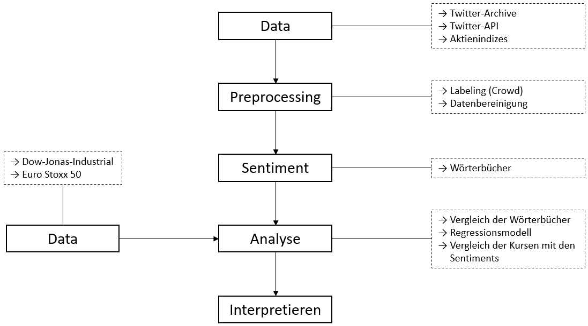

---
classoption: oneside
documentclass: article
fontsize: 12pt
header-includes:
- \usepackage{amsthm}
- \usepackage{xcolor}
- \usepackage[ngerman]{babel}
- \usepackage[utf8]{inputenc}
- \usepackage{amsmath}
- \usepackage{amsfonts}
- \usepackage{amssymb}
- \usepackage[mathscr]{euscript}
- \usepackage{graphicx}
- \usepackage{subcaption}
- \usepackage{tabularx}
- \usepackage{url}
- \usepackage{hyperref}
- \usepackage[]{algorithm2e}
- \usepackage{mdframed}
- \usepackage{lipsum}
- \usepackage{extarrows}
- \usepackage[most]{tcolorbox}
- \usepackage{color}
- \usepackage{paralist}
- \usepackage{amsthm}
- \usepackage{blindtext}
- \usepackage{fancyhdr}
- \usepackage{colortbl}
- \usepackage{framed}
- \usepackage{float}
- \usepackage{listings}
- \usepackage{fancyhdr}
- \usepackage{geometry}
- \usepackage[onehalfspacing]{setspace}
geometry: top=2.5cm, bottom=2.5cm, left=2.5cm, right=2.5cm

output:
  pdf_document:
    number_sections: yes
---

\newcommand{\mybox}[1]{%
  \tikz[baseline=(text.base)]
    {\node [draw,rounded corners,fill=red!20] (text) {#1};}%
}

\newtheoremstyle{normal}
{10pt} 
{10pt}
{\normalfont}
{}
{\bfseries}
{}
{0.8em}
{\bfseries{\thmname{#1} \thmnumber{#2}\thmnote{ \hspace{0.5em}(#3)\newline}}}
\theoremstyle{normal}

\newtheorem{satz}{Satz}
\newtheorem{defin}{Definition}
\newtheorem{beispiel}{Beispiel}


\pagenumbering{roman}
\setcounter{page}{2}

\numberwithin{equation}{section}
\numberwithin{figure}{section}
\renewcommand{\headrulewidth}{0.5pt}

\lhead{\nouppercase{\rightmark}}\rhead{}
<!-- \renewcommand{\sectionmark}[1]{\markright{\thesection.\ #1}} -->
<!-- \onehalfspacing -->
<!-- \cleardoublepage -->


<!--- Titelseite ---> \input{Titelblatt2} 
\pagestyle{fancy} 
\fancyhf{}
\fancyhead[R]{} 
\fancyhead[L]{\leftmark} 
\renewcommand{\headrulewidth}{0.4pt} 
\fancyfoot[C]{\thepage} 
\renewcommand{\footrulewidth}{0.4pt} 
<!--- Inhaltsverzeichnis ---> \tableofcontents\newpage
\addcontentsline{toc}{section}{Abbildungsverzeichnis}
<!--- Abbildungsverzeichnis ---> \listoffigures\newpage
\setlength{\parindent}{0pt} 
\renewcommand{\footrulewidth}{1pt}
\pagenumbering{arabic}

<!--- Beginn --->
\section{Ergebnisse}
Der Kurs einer Aktie setzt sich aus einem Angebot und einer Nachfrage zusammen. Die Nachfrage bzw. das Angebot einer Aktie wird von mehreren Faktoren, wie der aktuelle Stand des Unternehmens, die Art und Weise wie in den Neuigkeitsprotalen berichtet wird u. v. m. beeinflusst. Einer unserer Annahmen ist, dass Twitter ebenfalls einen Einflussfaktor für den Kurs sein kann. Ein ähnliches Vorgehen wurde bereits von Cindy K Soo. \cite{sentiment_housing} bezüglich den Immobilensektor gezeigt. In Ihrem Paper zeigt sie, dass die Lokalnachrichten den Immobilienmarkt um Jahre voraus beeinflussen. Diese Idee wollen wir in dieser Ausarbeitung auf Twitter und dem Finanzmarkt aufnehmen und versuchen zu beobachten, ob ein Einfluss nachweisbar ist. Hierzu wird versucht die Stimmungen aus den Banken Tweets zu extrahieren. Die Stimmung der Tweets sollte uns eine Richtung vorgeben für Aktienindizes. 

Ein Ziel dieser Ausarbeitung ist einen Zusammenhang zwischen dieser Stimmung und der Aktienindizes nachzuweisen. Die Ausgangssituation wird der Finanzbereich und die Aktienindizes aus dem Jahr 2012 sein.

<!-- Die Analyse von Wörter auf emotionale Ebene liefern wichtige Information über Texte. Mit diesen Informationen kann methodisch erkannt werden, ob ein Textabschnitt positiv oder negativ ist bzw. die Stimmung einfangen.
Das Ziel dieser Ausarbeitung ist einen Zusammenhang zwischen dieser Stimmung (\textit{Sentiment}) der Tweets bezüglich dem Finanzbereich aus dem Jahr $2012$ und Aktienindizes nachzuweisen. --> 
<!-- W?rding wirtschaftliche Ereignisse -->
<!--Unsere Annahme ist, dass Events im Finanzsektor sich in Tweets früher abzeichenen, als in Aktienindizes. -->

<!--sich schneller auf die sozialen Medien verbreiten. Dies nehmen wir als Anhaltspunkt und versuchen Ereignisse am Aktienindex vorherzusagen. -->

<!-- Im Jahr 2012 war die Grieschenlandkrise ein zentrales Ereignis für den Finanzmarkt Europas. Dadurch ergibt sich die Fragestellung, ob man dieses Ereignis auf eine Art und Weise hätte vorhersagen können. -->

<!--Als Beispiel dient die Griechenlandkrise im Jahr $2012$. Zu der Zeit der Griechenlandkrise sind viele Hashtags entstanden und die Bürger der EU haben ihre Meinung in Tweets kundgetan. Hashtags die sich auf wichtige politische Entscheidungen im Zusammenhang der Griechenlandkrise sich beziehen, waren zum Beispiel \#Grexit,\#G7, \#Greferendum und \#EuroGipfel. Unter diesen Hashtags haben sich gewisse Informationen schnellverbreit. Diese Informationen hatten, im späteren einen gewissen Einfluss auf die Aktienindizes. -->

Mittels Textmining sollen die Informationen aus den Tweets in einen Sentimentindex umgewandelt werden. Mit diesem Sentimentindex wird versucht mit einer Regression den Aktienindizes vorherszusagen. In Abbildung \ref{Reg_afinn1} ist unser Ergebnis zu sehen. Dabei handelt es sich um eine Regression auf wöchentlichen prozentualen Veränderungen der Aktienindizes. Die blauen Kreise stellen die Veränderungen des Aktienindxes dar und die Regressionsgrade versucht diese zu erklären. Der erklärende Anteil beträgt $3.84 \%$. 


<!--Mittels erzeugten Sentimentindizies aus den Tweets können Zusammenh?nge sichtbar gemacht und Regressionen auf Aktienindizes durchgeführt werden.--> 

 \begin{figure}[H]
   	\centering
  \includegraphics[width=0.8\textwidth]{Pictures/Afinn_plot.png}
   	\caption{Multiple Regression mittels Sentimenindex auf einen Aktienindex}\label{Reg_afinn1}
\end{figure}

In diesem Paper wird die thematische die Aufbereitung der Daten, die korrekte Wahl des Wörterbuches, den Zusammenhang zwischen Aktienindizes und Sentimentindizes und die vorgestellte Regression auf Aktienindizes besprochen.

\newpage

\section{Daten}
Ein Sentiment ist die Stimmung bzw. die Emotion des Schreibers, die der Text beinhaltet. Als Datengrundlage dient uns das Twitterarchiv und die Twitter-API, siehe Unterkapitel \ref{sub:twitter_archive} und \ref{sub:scanned_data}. Um die errechneten Sentiments vergleichen zu können, wurde der Dow Jones Industrial 30 Aktienindex und der EURO-STOXX 50 aus dem Jahr 2012 verwendet, siehe Unterkapitel \ref{sub:dow_jones_data}.


\subsection{Twitterarchiv}
\label{sub:twitter_archive}
Twitter veröffentlicht monatlich 1 \% ihrer gesamten Tweets auf \textit{archive.org} \cite{twitter_archive}. Dieses Twitterarchiv wurde auf dem hauseigenen CUDA-Rechner aus dem Jahre 2012 in einem R-spezifischen DataFrame aufbereitet und zur Verfügung gestellt. Da diese Archiv alle Tweets enthält, auch Tweets die themenfremd sind, wurde ein Filter gebaut, der die benötigten Daten filtert.


In Abbildung \ref{fig:filter} ist einer unserer Filter für die grieschichen Banken zu sehen. Die Begriffe, nachdem gefiltert wird, sind in grün zu sehen. Diese sind jeweils durch einem logischen \textit{Oder} getrennt. Falls ein Begriff in einem Tweet gefunden wird, wurde dieser Tweet in unserem Datenbestand mitaufgenommen. 

Eine große Herausforderung war das Finden sinnvoller Filter. Ist der Filter nicht wohlwollend gewählt, könnten folgende Fälle eintreten, die sich möglicherweise negativ auf dem Sentiment auswirken.

 * Ist ein Filter zu allgemein gewählt, besteht die Möglichkeit in Überschneidungen mit weiteren nicht bezogenen Themen zu laufen. Beispielsweise ist der Filter \textit{Bank} sehr allgemein gewählt, da die Bank im Park oder die Bank im Glücksspiel gemeint sein könnte. An dieser Stelle besteht die Möglichkeit die Anzahl der nicht gewollten Tweets abzuwägen. Sind diese anteilig gering, kann der Filter aufgenommen werden.
 * Ist ein Filter zu speziell gewählt, besteht die Möglichkeit zu wenige Tweets zu finden.

Die Wahl der Begriffe ist demnach ein Trade-Off zwischen der Noise, die Anzahl der nicht relevanten Themen, und die Anzahl der gesamten Tweets, die nach dem Filtern übrig bleibt. Werden die Begriffe zu allgemein gewählt, werden viele Tweets einbezogen, jedoch könnte dadurch die Noise sehr hoch werden. Werden die Filter zu streng gewählt, besteht die Möglichkeit zu wenige Tweets nach dem Filtern einzubeziehen.

Insgesamt haben wir ca. $17.000$ Tweets durch die gewählten Filter über das gesamte Jahr $2012$ selektiert. Da das Sentiment wöchentlich gebildet wird, sind das ca. $325$ Tweets pro Woche.

\subsection{Twitter-API}
\label{sub:scanned_data}
Zu Beginn war unklar, ob ausreichend Daten durch das Twitterarchiv gewonnen werden können. Dadurch kam die Idee auf die Twitter-API zusätzlich zu verwenden. Die Twitter-API erlaubt $450$ Anfragen alle $15$ Minuten. Der Kern des PHP-Skriptes wird durch folgenden Code erleutert.

```{php testphp}
// Query with one Hashtag and a limit up to 100
// GET call
$getfield = '?q=' . $hastag . '&
              result_type=recent&
              count=100&
              tweet_mode=extended';

// Setting up the Twitter-API
$twitter = new TwitterAPIExchange($this->settings);

// Perform the request
$data = $twitter->setGetfield($getfield)
                ->buildOauth($this->url, $this->requestMethod)
                ->performRequest();
```

Der obige Code zeigt die Abfrage eines Hashtags. Die verschiedenen Hashtags werden mittels einer Schleife iteriert. Der Abruf (GET) wird mit einem URL-Aufruf realisiert, der mit verschiedenen Einstellungen, wie Anzahl der maximalen Tweets (\textit{100}), welcher Typ (\textit{recent}) und in welchen Mode (\textit{extended}) werden die Tweets zurück gegeben, aufgerufen werden kann. Als nächstes werden die Settings übergeben. Die Twitter-spezifischen Settings werden nach der Registration im Entwicklungsbereich auf deren Webseite generiert. Danach wird die Abfrage mittels der Twitter-Klasse realisiert. Die Rückgabe enthält ein Array im JSON-Format mit den letzten $100$ Tweets. Zum Speichern werden die Tweets aufbereitet und als JSON-Format gespeichert.

Aktuell muss das Skript manuell ausgeführt werden. Dieses Problem haben wir durch ein \textit{Cronjob} gelöst. Ein Cronjob führt in definierten Intervallen oder an definierten Zeitpunkten ein Event, in unserem Fall eine PHP-Datei, aus. An dieser Stelle wurde entschieden die höher frequentierten Tweets auf einem zwei Minuten Intervall und weniger frequentierten Tweets auf einem $15$ Minuten Intervall zu setzen.


\subsection{Aktienindizes aus 2012} 
\label{sub:dow_jones_data}
Der \textbf{Dow-Jones-Industrial} $30$ Index misst die Entwicklung des US-amerikanischen Aktienmarktes. Der Dow-Jones-Index an der New York Stock Exchange (NYSE) ist einer der ältesten noch bestehenden Aktienindex der USA und setzt sich heute aus den $30$ größten US-Unternehmen zusammen. Der tägliche Aktienindex des Dow-Jones-Industrial $30$ $2012$, der für die späteren Regressionen verwendet wird, stammt von der Seite \textit{boerse-online.de} \cite{boerse_online}. Die Daten werden in eine Excel-Datei übertragen. Anschließend wird die wöchentliche Veränderung des Aktenindex in Prozent berechnet. In der Abbildung \ref{picture:dow_jones} ist ein Auschnitt der aufbereiteten Daten zusehen.
 \begin{figure}[H]
   	\centering
  \includegraphics[width=1\textwidth]{Pictures/Dow_jownes.png}
   	\caption{Ausschnitt des aufbereiteten \textit{Dow Jones Industrial} $30$ Aktienindexes}
   	\label{picture:dow_jones}
 \end{figure}
 
Für den Vergleich der wirtschaftlichen Situation in der EU, wird der \textbf{EURO-STOXX 50} herangezogen. Der EURO-STOXX $50$ ist ein Aktienindex, der sich aus den $50$ größten, börsennotierten Unternehmen des Euro-Währungsgebiets zusammensetzt. 

\newpage

\section{Preprocessing}
\label{sub:datenaufbereitung}
Für die Berechnung der Sentimentindizes werden ausschließlich Tweets betrachtet die mit dem sprachlichen Kürzel \textit{eng} gekennzeichnet sind. 

Im Folgendem werden die einzelnen Schritte für die Aufbereitung der Daten beschrieben, die erforderlich sind, um auf Basis von Wörterbüchern verschiedene Sentimentindizes zu berechnen. Hierzu werden eigens programmierten Funktionen benutzt.

\begin{enumerate}
\item Die erzeugten CSV-Datei mit den gefilterten Tweets werden mit der Funktion \textit{Datei$\_$einlesen} eingelesen und in ein Dataframe umgewandelt.
\item Um ein Vergleich mit dem Dow Jones \ref{sub:dow_jones_data} zu ermöglichen, wurden die Wochen- und Monatsnummer des Twitterarchivs \ref{sub:twitter_archive} berechnet und aufgenommen (\textit{Month2} \& \textit{week}). 
\item Die doppelten Tweets wurden mittels der Funktion \textit{Distinct} gefiltert.
\item Mit der Funktion \textit{clearing$\_$dataframe} werden die Texte der Tweets in einzelnen Wörter aufgesplittet. Damit besteht ein Tweet aus mehreren Zeilen und eine Zeile jeweils nur aus einem Wort. Anschließend wird das Dataframe von StopWörtern bereinigt, die in der Wörterliste \textit{Stopwords} enthalten sind. Die Tabelle \ref{tab:dataaufbereitung} zeigt einen Ausschnitt der ersten Wochen des aufbereitenden Dataframes. Die Spalte \textit{X} gibt die ID des jeweiligen Tweets an zu dem das Wort gehört. Dieses Dataframe gilt als Grundlage für die nächsten Kapitel. 


\begin{table}[H]
\centering
\begin{tabular}{|l|l|l|l|l|l|l|l|}
\hline
\textbf{id} & \textbf{X} & \textbf{Language} & \textbf{Follower} & \textbf{favourites\_coun} & \dots & Month2 & week \\ \hline
2           & 12         & en                & 1114              & 0                         &              & 1      & 1    \\ \hline
3           & 12         & en                & 114               & 0                         &              & 1      & 1    \\ \hline
 \vdots           &   \vdots           &  \vdots                  &  \vdots                 &  \vdots                         &  \dots            &  \vdots      &  \vdots    \\ \hline
12          & 13         & en                & 319               & 0                         &              & 1      & 1    \\ \hline
13          & 13         & en                & 319               & 0                         &              & 1      & 1    \\ \hline
 \vdots           &   \vdots           &  \vdots                  &  \vdots                 &  \vdots                         &  \dots            &  \vdots      &  \vdots    \\ \hline
\end{tabular}
\caption{Aufbereites Dataframe}
\label{tab:dataaufbereitung}
\end{table}
\end{enumerate}

\newpage

\section{Wörterbücher}
\label{Woerterbuch}
Ein Mensch ist in der Lage nachdem Lesen eines Textes zu beurteilen welche Stimmung dieser wiederspiegelt. Das Tweetbeispiel: "Der Kurs ist gut! #bitcoin", spiegelt eine positive Resonanz bezüglich Bitcoin wieder. Eine Variante, wie mittels Text Mining ein Sentiment gebildet werden kann, ist die einzelnen Wörter oder Wortgruppen (n-gramms) mittels einem Wörterbuch zu bewerten. Wird bezüglich unserem Beispiel das Wort gut betrachtet, wird dieser wahrscheinlich positiv bewertet.

Ein Wörterbuch, auch Lexika genannt, besteht aus einer Liste von Wörtern, die von einem oder mehreren Individuen bewertet wurden. Die Bewertung kann 1/0, Negativ/Positive, 0-10, eine Stimmung u. s. w. sein. Die Abbildung \ref{fig:worterbuch} zeigt ein Wörterbuch aus dem R-Package \textit{tidytext}. Die Spalte \textit{word} steht für das bewertende Wort und \textit{sentiment} für deren Bewertung.


Ein \textbf{Hononym} ist ein Begriff für die Doppeldeutigkeit eines Wortes, zum Beispiel \textit{Bank}. Wird ein Wort für ein Wörterbuch bewertet, muss der Kontext in dem sich das Wörterbuch befindet, beachtet werden. Angenommen es existieren zwei Wörterbücher, wobei jeweils eins für die Natur und eins für den Immobiliensektor abgestimmt ist. Das Wort \textit{Bank} kann in diesem Fall zwei unterschiedliche Bewertung pro Wörterbuch enthalten. In der Natur könnte eine Bank eher als positiv bewertet werden, wohingegen die Bank für den Immobiliensektor eher negativ ausgelegt werden könnte.

Um die \textbf{Güte eines Wörterbuches} beurteilen zu können, werden Tweets benötigt, die in irgendeiner Art und Weise durch eine Bewertung markiert sind. Der gegebene Datensatz aus Kapitel \ref{sub:scanned_data} von Tweets erhielt kein Merkmal, welches auf eine Stimmung hinweisen könnte. Die Konsequenz war Teile des Datensatzes manuell und subjektiv zu bewerten. In Abbildung \ref{fig:testdata_bewertet} sind die Bewertungungen mit \textit{sentimentOriginal}, den Tweettext mit \textit{full\_text} und die Nummerierung mit \textit{X} zusehen.


\subsection{Verwendete Wörterbücher}

In diesem Bericht wurden die Wörterbücher \textit{bing}, \textit{afinn}, \textit{loughran} und \textit{nrc} aus dem R-Package \textit{tidytext} und das vaderSentiment \cite{vader} verwendet. Diese bestehen aus Unigrammen (einzelne Wörter).

\begin{table}[H]
\centering
\begin{tabular}{l|rrr}
\textbf{Wörterbuch}     & \multicolumn{1}{l}{\textbf{Bewertungsart}} & \multicolumn{1}{l}{\textbf{Intelligenz}} & \multicolumn{1}{l}{\textbf{Programmiersprache}} \\
\hline
\textbf{bing}           & Positiv/Negativ                            & -                                        & R                                               \\
\textbf{afinn}          & -5 bis 5                                   & -                                        & R                                               \\
\textbf{loughran}       & Positiv/Negativ                            & -                                        & R                                               \\
\textbf{nrc}            & Emotionen                                  & -                                        & R                                               \\
\textbf{vaderSentiment} & -4 bis 4                                   & vaderSentiment                           & Python                                         
\end{tabular}
\caption{Übersicht der verwendeten Wörterbücher}
\label{tab:used_wordbooks}
\end{table}

In Tabelle \ref{tab:used_wordbooks} sind die verwendeten Wörterbücher mit deren Bewertungsart, ob eine Intelligenz verfügbar und in welcher Programmiersprache dieses Wörterbuch ursprünglich vorhanden war, aufgelistet. Die Wörterbücher \textit{bing} und \textit{loughran} arbeiten mit positiven und negativen Bewertungen. \textit{afinn} arbeitet mit einer Bewertungsreichweite von $-5$ bis $5$, wobei $-5$ die negativste- und $5$ die positivste Stimmung wiederspiegelt. \textit{nrc} arbeitet als Ergebnis mit Emotionen, die zur Vergleichbarkeit ebenfalls in Positiv/Negativ umgewandelt werden. Das Wörterbuch \textit{vaderSentiment} wurde von $10$ unabhängigen Menschen manuell mit der Bewertungsreichweite $-4$ bis $4$ bewertet und der Durchschnitt und die Standardabweichung berechnet. Weiterhin wurde eine Logik von den Machern hinterlegt, die Verneinung, Satzzeichen, groß geschriebene Wörter u. v. m. bei der Berechnung des Sentiments beachtet. Die Logik wurde in Python umgesetzt.


Zu Beginn wurden mittels den fünf Wörterbüchern ein Sentiment über den Testdatensatz auf Tweetebene berechnet. Diese Berechnung wurde mittels der Abbildung \ref{fig:ubereinstimmung_nothing} mit dem Hunspell-Stemmer und der Rechtschreibkorrektur visualisiert, siehe Unterkapitel \ref{word_stemming}. Jeder Block entspricht ein Wörterbuch und jeder Balken spiegelt die Anzahl der Treffer wieder. 

 * Die \textit{Hits} sind die Anzahl der gesamten Treffer.
 * Die \textit{noHits} spiegelt die Anzahl der keinen Treffer wieder.


Die Wörterbücher "bing", "afinn" und "nrc" können insgesamt um die $70$ Übereinstimmungen aufweisen, wohingegen "loughren" knapp über $50$ Treffern liegt. Das erfolgreichste Wörterbuch ist "vader" mit ca. $120$ übereinstimmmungen. 

\subsection{Stemming}
\label{word_stemming}

Die Idee hinter Stemming ist das Reduzieren einer Wortvariante auf seinem Wortstamm. Zum Beispiel werden die Wörter \glqq Häuser\grqq und \glqq Häusern\grqq zu deren Wortstamm \glqq Haus\grqq reduziert.

Um das Stemming durchzuführen, wurde das R-Package \textit{corpus} \cite{corpus} verwendet . Die folgenden Varianten des Stemmings wurden durchgeführt. Die folgenden Stemmer und Rechtschreibkorrekturen wurden betrachtet.

 * \textit{corpus-standard} unterstützt vom Haus aus $17$ unterschiedliche Sprachen, um ein Wortstamm zu bilden. Da der gegebene Datensatz aus englischen Texten besteht, wurde nur die englische Sprache des Standard-Packetes betrachtet. 
 * Der \textit{Hunspell stemmer} soll prezise Stämme bilden.
 * Der \textit{Dictionary stemmer} wird on-the-fly von \textit{lexoconista.com} als Tupels von Wörtern und Stämmen geladen und mittels einer Funtkion den corpus-Package übergeben.
 * Hunspell liefert eine \textit{Rechtschreibkorrektur} mit. Zu Beginn wird geprüft, ob das Wort im Hunspell-Stemming-Wörterbuch existiert. Falls das Wort existiert, wird der Wortstamm zurück gegeben. Falls das Wort im Hunspell-Stemming-Wörterbuch nicht existiert, werden versucht ähnliche Wörter mittels der bereits existierten Funktion zu finden.
 
Für die gestemmten Tweets wurden die gleichen Auswertungen berechnet, wie in Abbildung \ref{fig:ubereinstimmung_nothing} zusehen ist. Dabei verschlechterten alle Stemming-Verfahren das Ergebnis. Die einzige Ausnahme gilt der Rechtschreibkorrektur, die insgesamt zwei Tweets mehr erkennt.

\newpage

\section{Explorative Analysen von Sentimentindizies}
In diesem Abschnitt werden Methoden angerissen, die Tweets und Sentimentindizes analysieren, siehe Buch \cite{textmining}. Um einen ersten Eindruck der Tweets zu erhalten, ist es vom Vorteil die am häufigsten vorkommenden positivsten und negativsten Wörter zu visualisieren, zusehen im Anhang \ref{anz:woerter}. 

\input{Woertbuchana}

\newpage

\section{Fazit}

Zu Beginn wurde das Twitter-Archiv bereitgestellt. Aus diesem haben wir sinnvolle Tweets bezüglich der Finanzbranche extrahiert. Vor der Extraktion war unklar, ob genügend Tweets extrahiert werden können, weswegen eine zweite Quelle, die Twitter-API \ref{sub:scanned_data} hinzugezogen wurde. Danach wurden im Kapitel \ref{sub:datenaufbereitung} die Daten aufbereitet und erweitert. Als nächstens haben wir mehrere Wörterbücher und Stemming-Verfahren verglichen, siehe Kapitel \ref{Woerterbuch}. 



Der Abschnitt für den Vergleich der verschiedenen Sentimentindizes hat die Schlussfolgerung, dass die verschiedenen Sentimenindizes der Wörterbücher \textit{Vader}, \textit{Bing}, \textit{loughran}, \textit{nrc} und \textit{Afinn} ein ähnliches Verhalten aufweisen. Im Kapitel \ref{ueberein} wurden Gemeinsamkeiten der zeitlichen Abläufe zwischen den Sentimentindizes und den Aktienindizes untersucht. In vielen Abschnitten wurde ein ähnlichen Verhaltens erkannt. Der nächste Schritt wäre eine Korrelation zwischen den beiden Zeitreihen nachzuweisen und somit visuale Beurteilung zu untermauern.

Die Ergebnisse aus dem Kapitel \textit{Modell} zeigen, dass sie geringefüge neue Informationen liefern, um die wöchentliche prozentuale Veränderung des Aktienindexes zu erklären. Dieses Erlebnis ist nicht ungewöhnlich. Es wird davon ausgegangen, dass die Sentimentindizes und der Aktienidex sehr stark korrelieren müssten, da sie von den gleichen Faktoren beeinflusst werden. Daher ist es umso erstaunlicher, dass überhaupt ein erster Hinweis erbracht werden konnte, dass die Sentimentindizes noch Informationen beinhalten, die die Aktienindizes erklären können.

\newpage

\section{Ausblick}
Der nachstehende Text soll einen kurzen Ausblick über weitere Vorgehensweise geben.

Neben weiteren Wörterbüchern, Stemming-Verfahren und besseren Rechtschreibkorrekturen besteht die Möglichkeit anstatt 1-gram (Unigrammen) mit 2-gramme (Bigramme) oder 3-gramme zu arbeiten. Das bedeutet dementsprechend angepasste Wörterbücher zu verwenden. Laut E. Martínez-Cámara \cite{bigram_ref} ist dieser Ansatz sehr vielversprechend.

Ein weiterer interessanter Ansatz um die Sentiments stabiler und genauer zu bestimmen, ist das Verwenden mehrerer Wörterbücher. Die Sentiments dieser Wörterbücher laufen für das Endergebnis nochmal durch ein Votum. Angenommen drei Wörterbücher beurteilen ein Tweet. Zwei Wörterbücher bestimmen den Tweet als negativ und das dritte als positiv. Im nächsten Schritt wird durch das Votum der Tweet als negativ klassifiziert, da mehr Wörterbücher den Tweet als negativ eingestuft hatten. Das Votum kann durch eine Gewichtung der Wörterbücher verfeinert werden.

Außerdem besteht die Möglichkeit eine Logik mit den Wörterbüchern zu verknüpfen. Die Logik könnte in der Lage sein Verneinungen zu erkennen, wie \glqq Der Kurs ist nicht schlecht! #bitcoin\grqq{}. 

Um den Zusammenhang zwischen den Sentiment- und den Aktienindizies besser Beurteilen zu können, könnte eine Erhöhung der Zeitspanne helfen. Weiterhin kann eine nicht lineare Regression, multiplikatives Regressionsmodells, Logarithmierung Regressionsnmodells, oder an der Variation der Regressoren geschraubt werden. Ein Ansatz, um die Targets (Aktienindizes) besser anhand der Sentimenindizes zu erklären, ist die Zeitreihenanalyse. Hier könnte auf die Modelle MA- und AR eingeganen werden. Man spricht von multivariater Zeitreihenanalyse, wenn die Wechselwirkungen zwischen mehreren Zeitreihen mitanalysiert werden.

\newpage

\pagenumbering{roman}\setcounter{page}{3}

\input{Literratur}
\begin{appendix}
\section{Anzahl der Wörter}
 \begin{figure}[H]
\centering
 	\includegraphics[width=1\textwidth]{Pictures/positv_negativ.png}
 	\caption{Barplot der 10 am häufigsten vorkommenden positivsten und negativsten Wörter} \label{barplot}
\end{figure}

Ein Schritt für die Erstellung eines Sentimentindizes ist die Wahl des richtigen Wörterbuchs, siehe Kapitel \ref{Woerterbuch}. Durch eine erste Visualisierung \ref{barplot} kann festgestellt werden, wie gut das ausgewählte Wörterbuch zur Fragestellung bzw. zum Anfangsproblem passt. Bei Betrachtung der Grafiken passen einige Wörter sehr gut, wie fraud, stress, strike, win, support, top oder free und andere weniger gut, wie zum Beispiel fans, wow, die oder auch hate, zur Ausgangssituation einen Sentimentindex für Banken zubauen. In unseren Fall passt das ausgesuchte Wörterbuch \textit{Bing} nicht optimal, aber insgesamt ganz gut.


\section{Berechnung der Sentimentindizes}
für die Berechnung von Sentimentindizes wird nach dem Buch \textit{Text Mining with R} von \textit{Julia Silge and David Robinson} vorgegangen. Im Buch \textit{Text Mining with R} werden die Sentimentindizes mittels dem Prinzip \textit{tidy data} in R erstellt. Ein Beispiel für einen einfachen Sentimentindex, der positive und negative Wörter für jede Woche zählt, soll vorgestellt werden. Zur Berechnung des Sentimenindex wird das vorbereitete Dataframe aus dem Kaptiel \textit{Datenaufbereitung} benutzt. Zuerst wird der vorbereitete Dataframe mit dem Wörterbuch \textit{Bing} gejoint mit der gleichnamige Spalte \textit{word}. Im Anschluss wird der Dataframe gruppiert nach Wochen und dabei werden die verschiedene  Ausprägungen (\textit{positiv} und \textit{negativ}) in der Spalte \textit{Sentiment} gezählt. für die gezählten Ausprägungen pro Woche entsteht eine neue Spalte \textit{n}. In der Spalte \textit{Sentiment} stehen die Wörter (Ausprägungen) \textit{positiv} oder \textit{negativ} passend zu dem Wort in der Spalte \textit{word} im Datensatz. Um einen Index pro Woch zu berechnen, wird eine Spalte für jede Ausprägung mit ihrer Anzahl pro Woche erzeugt, aus den Spalten \textit{Sentiment} und $n$. Zum Schluss wird eine neue Spalte \textit{Sentiment} gebildet, indem die Anzahl der positiven minus den negativen Wörter stehen ($Sentiment=positiv-negativ$). Der Sentimentindex \textit{Sentiment} wird als Barplot dargestellt.

 \begin{figure}[H]
   	\centering
  \includegraphics[width=1\textwidth]{Pictures/codeindex.png}
 \end{figure}
 \begin{figure}[H]
   	\centering
  \includegraphics[width=1\textwidth]{Pictures/sentiment_bing_week.png}
   	\caption{Sentimentindex der Differenz positiver und negativer Wörter}
 \end{figure}

In der unteren Aufzählung werden einige Sentimentindizes berechnet, die von uns in R implementiert wurde. Die Funktionen der aufgezählten Sentimentindizes werden in der R-Datei \textit{SentimentFunctionChris.R} bereitgestellt. Bei allen Funktionen müssen zwei Parameter übergeben werden, den vorbereitete Dataframe und einen String (\textit{Woche} und \textit{Monat}) der angbit, ob ein Sentiment pro Woche oder pro Monat berechnet wird. 
\begin{itemize}
\item \textit{Wörterbuch Bing:} Einzelene Tweets werden als negative, positive oder als neutral gekennzeichnet. Die Tweets die mehr positive als negative Wörter besitzen, werden als positve makiert anders herum als negative, bei gleichstand als neutral.   
 \begin{figure}[H]
\centering
 	\includegraphics[width=1\textwidth]{Pictures/tweetebene.png}
 	\caption{Sentimentindex auf Tweetebene}
\end{figure}

\item \textit{Wörterbuch AFINN:} Die Funktion \textit{afinn$\_$score$\_$wert} bildet den Mittelwert pro Woche und Monat.
 \begin{figure}[H]
\centering
 	\includegraphics[width=1\textwidth]{Pictures/afinn_mittelwert.png}
 	\caption{Sentimentindex auf Tweetebene}
\end{figure}
\end{itemize}


\section{Beschreibung der Programmen und Dateien}
Im Ordner \textit{Testing/Modell} befinden sich die folgenden Dateien.
\begin{itemize}
\item \textbf{SentimentFunction2.R:} Die Datei \textit{SentimentFunktion2} enthält verschiedene Funktionen die Plots und Sentimentindizes berechnen.
\item \textbf{functions.R:} Die Datei \textit{functions.R:} beinhaltet die Funktion \textit{generateLinearRegressionDataFrame}. Mit dieser Funktion kann ein Dataframe mit einem Sentimentindex entsprechent transformiert werden für eine Regression. 
\item \textbf{Daten2012usa.xls:} US-Banken Tweets
\item \textbf{Daten2012europaneu3} EU-Banken Tweets
\item \textbf{Regression\_neu\_becker\_2012.Rmd:} Das Programm enthält verschiedene Regressions Ansätze und Sentimentplots.
\item \textbf{alteVersion.Rmd:} Dieses Programm beinhaltet eine veraltete Version von der Datei \textit{Regression\_neu\_becker-2012}.
\item Im Unterordner \textit{Daten} befinden sich Aufbereitete Excel-Dateien.
\begin{itemize}
\item  \textbf{daten\_usa\_new\_sentiment \_vader.xlsx:} Die Excel-Datei beinhaltet die gejointen Daten der Bankentweets und dem Wörterbuch Vader.
\item \textbf{Dow\_jones\_rendite\_2012.xlsx:} Excel-Datei beinhaltet die Dow Jones Industrial $30$ Daten
\end{itemize}
\end{itemize}
Im Ordner \textit{Testing/Woertbuch} befinden sich die Dateien zum Testen der Wörterbücher und Stemming-Verfahren.
\begin{itemize}
\item \textbf{testSentiment.R} berechnet alle Wörterbücher, Stemming Verfahren und Visualisierungen
\item \textbf{SentimentFunction.R} enthält Funktionen, die in \textit{testSentiment.R} verwendet werden.
\item Der Ordner \textbf{data} enthält die verschiedenen generierten Daten.
\end{itemize}

Im Ordner \textit{Testing/Filters} befinden sich die Dateien für das Filtern der Tweets auf dem Cuda-Rechner.

Im Ordner \textit{Testing/Datenaufteilung} befinden sich die Dateien den Versuch für das Aufteilen der Daten. Der Grund war, dass die Speicherauslastung von R-Studio mit einem DataFrame für normale Rechner zu groß war.
\end{appendix}
<!--
```{r  eval=FALSE, echo=TRUE}
source("../Testing/SentimentFunction2.R")
#source("varianz.R")
source("../Testing/functions.R")
pakete_lade()
#Aufbereitung der Daten----------------------------------
 file<-"../Testing/Daten2012usa.csv"
 daten_usa<-Datei_einlesen(file)

kalenderwochen_hinzufuegen<-Kalenderwochen(daten_usa)
daten_doppelt_loeschen<-Distinct(kalenderwochen_hinzufuegen)
clearing_data<- clearing_dataframe(daten_doppelt_loeschen)
```

```{r eval=FALSE, echo=TRUE}
   bing <- get_sentiments("bing")
    differenz_positive_negative<-  clearing_data  %>%
      inner_join(bing) %>%
      group_by(week)%>%
      count(sentiment) %>%
      spread(sentiment, n)%>%
      mutate(sentiment = positive - negative)
``` 
-->


